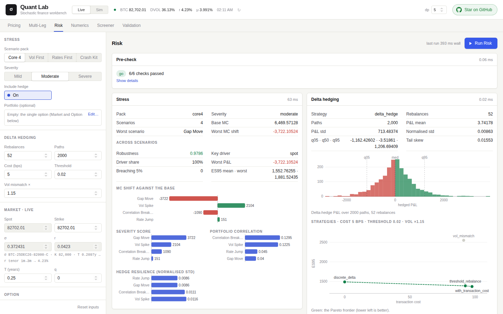
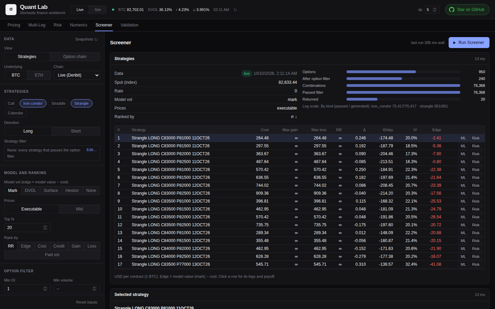

<div align="center">

# Quant Lab

**Price, calibrate, stress, hedge and screen options, on a C++23 engine with live market data: in the browser, or as tools for your AI agent.**

English · [中文](README.zh-CN.md)

[](https://dufanyin.dev/lab/)


[](doc/AGENT_TOOLKIT.md)
[](LICENSE)

</div>

**[Try it at dufanyin.dev/lab](https://dufanyin.dev/lab/)**: free, no sign-up, with live BTC data from Deribit. Or give it to
your agent: `claude mcp add --transport http quantlab https://dufanyin.dev/lab/mcp`.



## Why it is worth a look

- **Every number is checked against another.** A price comes from Black-Scholes, Monte Carlo, binomial and trinomial trees and
  finite differences side by side. A validation gate tests the numerics against theory before a run, can block it, and says what
  to change when a check fails.
- **Live market data, no API keys.** Spot, the DVOL index, funding, the US Treasury curve and full BTC / ETH option chains come
  from public endpoints. Every source falls back to cached or fixed values when offline.
- **Fast and reproducible.** The numerics are C++23 with OpenMP, and results are bit-identical whatever the thread count. The
  screener enumerates about two million iron condors in about 12 ms.
- **Made for agents too.** Each of its 26 tools explains itself: what it computes, its inputs with units, an example. An agent
  can use them over MCP or HTTP, or through the Python library and the command line, and every answer says how far to trust it.
- **One clean pipeline.** All the numerics live in the C++ engine. Python serves it, and the browser only draws, so each layer
  can be read on its own.

## What it does

| Mode | What you get |
|---|---|
| **Pricing** | an option priced every way at once, with all five Greeks; Black-Scholes implied vol and Heston calibration; a scenario sweep; Greek surfaces; the implied-vol term structure, smile and surface; a spot × vol batch grid |
| **Multi-Leg** | straddles, spreads, condors or any legs you enter, priced leg by leg with net Greeks; the strategy type is detected |
| **Risk** | four stress packs at three severities, with P&L attribution and a robustness summary; four delta-hedging strategies compared on the same paths, and the frontier of hedging cost against tail risk |
| **Numerics** | finite-difference PDE (explicit, implicit, Crank-Nicolson, PSOR for American); lattice convergence; a cross-method benchmark; the change of measure from P to Q |
| **Screener** | the live Deribit BTC or ETH chain turned into calls, straddles, strangles, iron condors and calendars, ranked by edge against a model vol; one click sends a strategy to Multi-Leg or Risk |
| **Validation** | moments, Itô's formula on discrete paths, simulation and hedging sanity, and the lattices against closed forms, each against a threshold, with ranked fixes |

| Screener (dark theme) | Pricing |
|---|---|
|  |  |

## Use it from an agent

The public lab is an MCP server. In Claude Code:

```bash
claude mcp add --transport http quantlab https://dufanyin.dev/lab/mcp
```

Then ask, for example, "find the cheapest BTC strangle with positive edge this month and stress it". Any MCP client works with
the same URL.

Your own copy works the same way, without limits:

```bash
pip install git+https://github.com/DuFanYin/stochastic-fin-research-lab   # builds the engine (see Quick start for what it needs)
claude mcp add quantlab -- quantlab mcp
```

The same tools can also be used:
- from Python: `quantlab.price_option(spot=100, strike=105, rate=0.03, vol=0.2, maturity=0.5)`;
- from a shell: `quantlab price_option --spot 100 ...`;
- over HTTP: `GET /api/tools` lists them, `POST /api/tools/<name>` runs one.

A model that reads the web can start from [llms.txt](https://dufanyin.dev/lab/llms.txt). All of it is described in
[doc/AGENT_TOOLKIT.md](doc/AGENT_TOOLKIT.md).

## Quick start

On Linux x86-64 (developed on Ubuntu 26.04):

```bash
sudo apt install build-essential cmake nlohmann-json3-dev python3-venv lsof
./run.sh build    # build the engine (Release), then start the server
./run.sh          # later: start the server with the existing build
```

Then open <http://127.0.0.1:8000/>. `PORT=8001 ./run.sh` picks another port. The API documentation is at `/docs`, a health
check at `/api/health`, and MCP at `/mcp`.

Or install it as a package, which builds the engine too, and run everything from one command:

```bash
pip install git+https://github.com/DuFanYin/stochastic-fin-research-lab
quantlab serve            # the page, the API and MCP on http://127.0.0.1:8000/
```

You need CMake ≥ 3.16, a C++23 compiler with OpenMP (tested with GCC 15.2), nlohmann/json, and Python ≥ 3.10. `run.sh`
creates `server/.venv`, installs `server/requirements.txt`, stops anything already on the port and starts uvicorn with
auto-reload. Node ≥ 20 is only needed to change the page: the built page is in `static/`.

For a debug build of the engine:

```bash
cmake -S engine -B engine/build -DCMAKE_BUILD_TYPE=Debug
cmake --build engine/build -j
```

## How it fits together

```
web/ → static/      the page: Preact + Tailwind, built by Vite; inputs, charts and the workflow, no numerics
      │  HTTP / JSON
server/quantlab/    Python: market data, the tools, and the ways to reach them (HTTP, MCP, Python, CLI); nothing numerical
      │  ctypes, JSON in / JSON out
engine/             C++23 + OpenMP: every computation, no I/O
```

A feature is added bottom-up: kernel primitive → engine workflow → result struct → C ABI → Python wrapper → tool → page.
[doc/DOCUMENTATION.md](doc/DOCUMENTATION.md) walks through each layer.

## Tests

```bash
server/.venv/bin/pip install -r server/requirements-dev.txt
server/.venv/bin/python -m pytest tests
```

There are 71 tests, and they run offline. They cover:
- the pricing methods and the theory checks;
- the screener and its routes, and the option-chain handling;
- every tool and every way of reaching it (HTTP, MCP, Python, CLI);
- the agent evals.

Two more sets are optional. - `QUANT_LAB_LIVE=1` adds a check against live Deribit data.
- `tests/reference/` compares the lattices and finite differences against the QF-205 Python package, and is skipped when that
  package is not available.

## The public lab

[dufanyin.dev/lab](https://dufanyin.dev/lab/) runs this repository for anyone.

So that one visitor cannot crowd out the others, each address gets 120 seconds of computing time, refilled over 10 minutes.
A Pricing run takes about 3 seconds, and the other modes well under one. The page shows how much is left. Heavy parameters are
capped, for example Monte Carlo at 200,000 paths. The same limits apply to the API and to MCP.

Run the lab yourself for no limits.

## Roadmap

Next comes run history: results kept and comparable across sessions, and citable by an agent through their run ID. Then
publishing the package on PyPI, and hedging for whole portfolios. See [doc/ROADMAP.md](doc/ROADMAP.md).

## Repository layout

| Path | Contents |
|---|---|
| `engine/src/kernel/` | numerical primitives: pricing, simulation, optimiser, statistics, screener |
| `engine/src/engine/` | domain workflows, one file per area |
| `engine/src/contracts/` | result structs |
| `engine/src/api/` | JSON parsing and the exported C ABI |
| `server/quantlab/tools/` | the tools: one registry, one module per area |
| `server/quantlab/` | the Python package: the HTTP app, MCP server, CLI, `llms.txt`, Python API |
| `server/quantlab/services/` | engine client, market data, stress library, Explainable QA |
| `server/quantlab/schemas/` | the tools' inputs, every field described |
| `server/quantlab/fixtures/` | recorded Deribit chains for offline use, and the script that records them |
| `web/` | the page's source: Preact components, Tailwind, SVG charts |
| `static/` | the built page (`cd web && npm ci && npm run build`), served at `/` |
| `tests/` | test suites |
| `evals/` | agent tasks with checkable answers, and the runner that gives them to Claude |
| `bench/concurrency/` | standalone benchmark: OpenMP against a thread pool on the engine's LSM, SPSC queue against a locked queue |
| `doc/` | the documentation, the roadmap, the agent guide, screenshots |
| `pyproject.toml` | the `quantlab` package (`pip install .` builds the engine) |

Option-chain snapshots are cached outside the repository, in `~/.quant-lab/` (override with `QUANT_LAB_HOME`).

## Further reading

- [doc/AGENT_TOOLKIT.md](doc/AGENT_TOOLKIT.md): connecting an agent, the tools, what comes back, the evals.
- [doc/DOCUMENTATION.md](doc/DOCUMENTATION.md): the architecture, every capability, market data, the API, the page, the agent
  toolkit, contracts, tests and where the code came from.
- [doc/ROADMAP.md](doc/ROADMAP.md): what has been built and what is next.
- [bench/concurrency/README.md](bench/concurrency/README.md): concurrency benchmark results, and why the engine uses OpenMP.

---

Made by [Hang Zhengyang](https://dufanyin.dev/), under the [MIT License](LICENSE). If the lab is useful to you, a ⭐ helps others find it.
