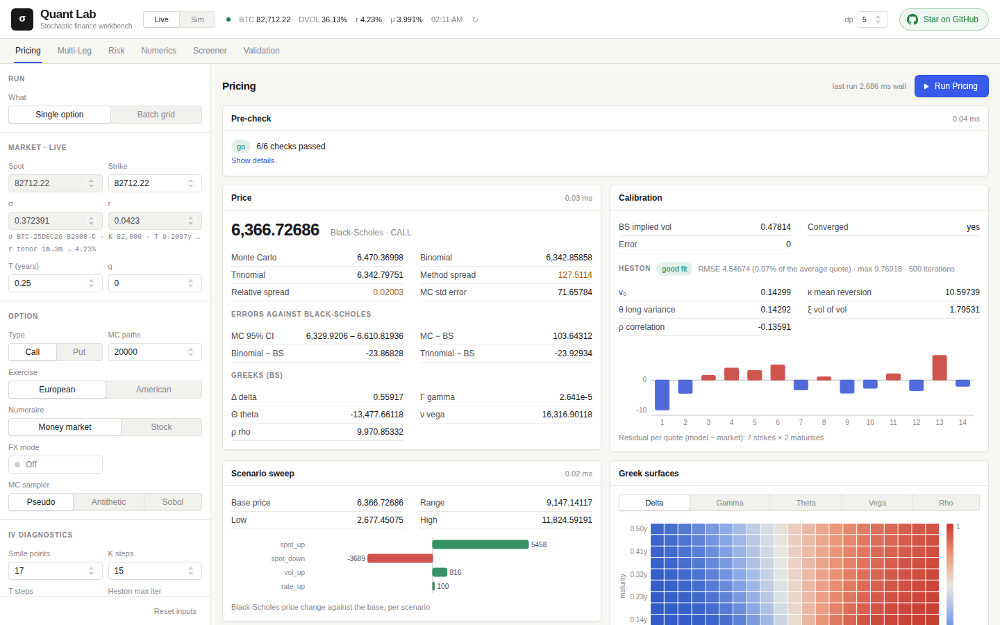

<div align="center">

# Quant Lab

**在浏览器里给期权定价、校准、压力测试、对冲和筛选，C++23 引擎计算，接实时行情。**

[English](README.md) · 中文

[](https://dufanyin.dev/lab/)


</div>

**[在线试用：dufanyin.dev/lab](https://dufanyin.dev/lab/)**。免费，不用注册，BTC 数据实时取自 Deribit。


## 值得一看的地方

- **每个数字都有另一种方法对照。** 同一个期权会同时用 Black-Scholes、Monte Carlo、二叉树、三叉树和有限差分定价，结果并排给出。
  运行前，验证门会先拿理论检查数值方法：检查不通过时可以拦下这次运行，并说明该改哪个参数。
- **实时行情，不需要 API key。** 现价、DVOL 指数、资金费率、美国国债收益率曲线和完整的 BTC / ETH 期权链都来自公开接口。
  离线时，每个数据源都会退回缓存值或固定值。
- **快，而且结果可复现。** 数值计算用 C++23 加 OpenMP，不管用多少线程，结果都逐位相同。筛选器枚举约两百万个铁鹰组合只要约 12 毫秒。
- **分层清楚。** 所有数值计算都在 C++ 引擎里，FastAPI 负责对外提供服务，浏览器只负责画图，每一层都可以单独读懂。

## 能做什么

| 模式 | 内容 |
|---|---|
| **Pricing** | 一次用所有方法给同一个期权定价，附全部五个 Greeks；Black-Scholes 隐含波动率和 Heston 校准；情景扫描；Greeks 曲面；隐含波动率的期限结构、微笑和曲面；现价 × 波动率的批量网格 |
| **Multi-Leg** | 跨式、价差、铁鹰或任意自定义组合，逐腿定价并给出净 Greeks，自动识别策略类型 |
| **Risk** | 四套压力情景、三档强度，附损益归因和稳健性汇总；四种 Delta 对冲策略在同一组路径上比较，并给出对冲成本与尾部风险的效率前沿 |
| **Numerics** | 有限差分 PDE（显式、隐式、Crank-Nicolson，美式期权用 PSOR）；树方法的收敛；跨方法基准；从 P 测度到 Q 测度的测度变换 |
| **Screener** | 把 Deribit 实时的 BTC 或 ETH 期权链组合成单腿看涨、跨式、宽跨式、铁鹰和日历价差，按相对模型波动率的 edge 排序；任何一条策略一键送到 Multi-Leg 或 Risk |
| **Validation** | 矩检验、离散路径上的 Itô 公式、模拟与对冲的合理性检查、树方法对照解析解，每项都有阈值，未通过时按优先级给出修复建议 |

| Screener（深色主题） | Pricing |
|---|---|
|  |  |

## 快速上手

需要 Linux x86-64（开发环境是 Ubuntu 26.04）：

```bash
sudo apt install build-essential cmake nlohmann-json3-dev python3-venv lsof
./run.sh build    # 编译引擎（Release），然后启动服务
./run.sh          # 以后：用已有的编译结果直接启动
```

然后打开 <http://127.0.0.1:8000/>。用 `PORT=8001 ./run.sh` 可以换端口。API 文档在 `/docs`，健康检查在 `/api/health`。

依赖：
- CMake ≥ 3.16；
- 支持 OpenMP 的 C++23 编译器（在 GCC 15.2 上测过）；
- nlohmann/json；
- Python ≥ 3.10。

`run.sh` 会依次做这几件事：
1. 创建 `server/.venv`，并安装 `server/requirements.txt`；
2. 停掉已经占用该端口的进程；
3. 以自动重载模式启动 uvicorn。

只有修改页面时才需要 Node ≥ 20，编译好的页面已经放在 `static/` 里。

引擎的调试版编译：

```bash
cmake -S engine -B engine/build -DCMAKE_BUILD_TYPE=Debug
cmake --build engine/build -j
```

## 整体结构

```
web/ → static/      页面：Preact + Tailwind，由 Vite 构建；负责输入、图表和流程，不做数值计算
      │  HTTP / JSON
server/             FastAPI：取行情、校验请求、路由、标注结果；不做数值计算
      │  ctypes，JSON 进 / JSON 出
engine/             C++23 + OpenMP：所有计算，不做 I/O
```

新功能自底向上加：内核原语 → 引擎流程 → 结果结构体 → C ABI → Python 封装 → 路由 → 请求模型 → 页面。
[DOCUMENTATION.md](DOCUMENTATION.md) 逐层说明（英文）。

## 测试

```bash
server/.venv/bin/pip install pytest
server/.venv/bin/python -m pytest tests
```

共 58 个测试，都能离线跑，覆盖：
- 各定价方法；
- 理论检查；
- 筛选器及其路由；
- 期权链处理。

另有两项可选：
- 设 `QUANT_LAB_LIVE=1` 会多一项对照 Deribit 实时数据的检查；
- `tests/reference/` 把树方法和有限差分跟 QF-205 Python 包对照，没装这个包时自动跳过。

## 公开实例

[dufanyin.dev/lab](https://dufanyin.dev/lab/) 运行的就是这个仓库，所有人都能用。

为了不让一个访客挤占其他人，每个地址有 120 秒计算时间，10 分钟回满。跑一次 Pricing 约 3 秒，其他模式都不到 1 秒，页面上会显示剩余额度。
计算量大的参数有上限，例如 Monte Carlo 最多 200,000 条路径。

在自己机器上运行就没有任何限制。

## 路线图

下一步是 **agent 工具库**：把整个 lab 做成 agent 可以调用的工具库，包括：
- 一份工具注册表，每个工具的 schema 都写给模型看；
- 一个 Python 包；
- 一个 MCP 服务器，本地版和托管版都有；
- 一个 CLI。

每个结果都会附上单位、所用假设和验证警告，让 agent 能自己判断一个数字可不可信。之后是运行历史、组合对冲和统一的返回格式。
详见 [ROADMAP.md](ROADMAP.md)（英文）。

## 目录

| 路径 | 内容 |
|---|---|
| `engine/src/kernel/` | 数值原语：定价、模拟、优化器、统计、筛选器 |
| `engine/src/engine/` | 各领域的计算流程，每个领域一个文件 |
| `engine/src/contracts/` | 结果结构体 |
| `engine/src/api/` | JSON 解析和导出的 C ABI |
| `server/src/api/` | FastAPI 路由 |
| `server/src/services/` | 引擎客户端、行情、压力测试库、Explainable QA |
| `server/src/schemas/` | 请求模型 |
| `server/fixtures/` | 离线用的 Deribit 期权链录制数据，以及录制脚本 |
| `web/` | 页面源码：Preact 组件、Tailwind、SVG 图表 |
| `static/` | 编译好的页面（`cd web && npm ci && npm run build`），在 `/` 提供 |
| `tests/` | 测试 |
| `bench/concurrency/` | 独立的并发基准：在引擎的 LSM 上比较 OpenMP 和线程池，比较 SPSC 队列和加锁队列 |
| `docs/images/` | 截图 |

期权链快照缓存在仓库之外的 `~/.quant-lab/`，可以用 `QUANT_LAB_HOME` 改位置。

## 延伸阅读

- [DOCUMENTATION.md](DOCUMENTATION.md)：架构、所有功能、行情数据、API、页面、接口约定、测试，以及代码来源。
- [ROADMAP.md](ROADMAP.md)：已经做了什么，接下来做什么。
- [bench/concurrency/README.md](bench/concurrency/README.md)：并发基准结果，以及引擎为什么用 OpenMP。

---

作者 [Hang Zhengyang](https://dufanyin.dev/)。如果这个项目对你有用，点个 ⭐ 能让更多人看到它。
